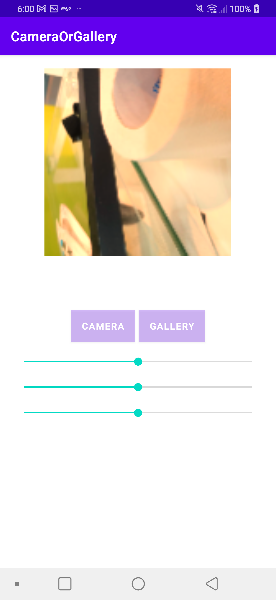
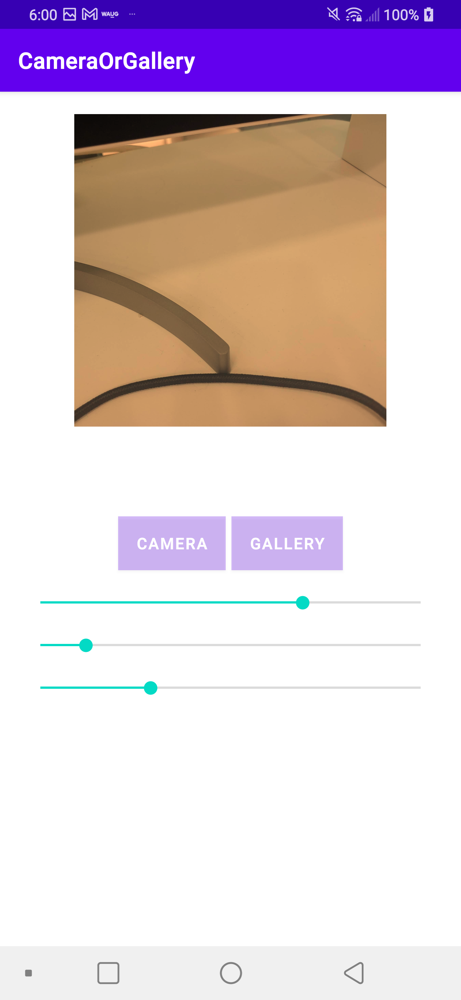

Camera or gallery Example
====================
1. camera에서 가져오기 
2. (WIP) FileProvider 에서 uri 가져오기 작업
3. Gallery에서 가져오기
4. ImageFilterView 적

Introduction
------------

Getting Started
---------------

Screenshots
-----------

Support
-------

- Stack Overflow:
  - https://developer.android.com/training/camera/photobasics?hl=ko (카메라)
  - https://developer.android.com/training/basics/intents/result?hl=ko (갤러리)
  - https://developer.android.com/jetpack/androidx/releases/exifinterface?hl=ko
  - https://riggaroo.dev/constraintlayout-2-0-imagefilterview/ (ImageFilterView)

